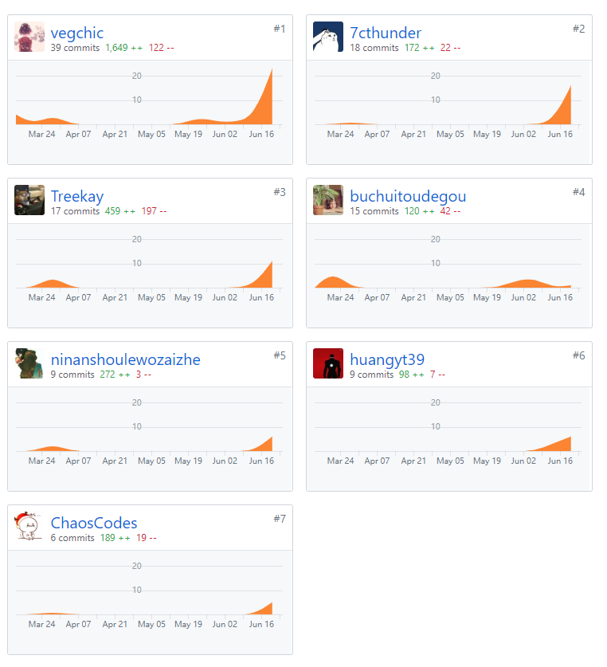
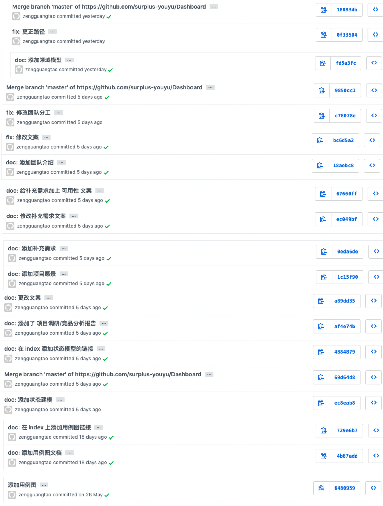
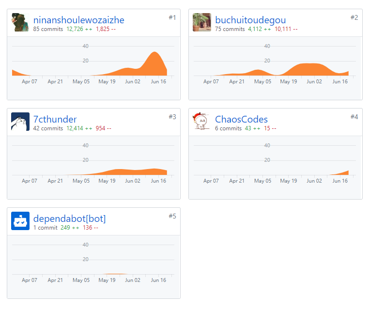
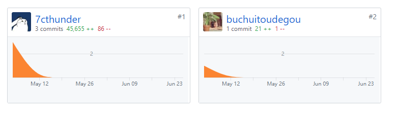
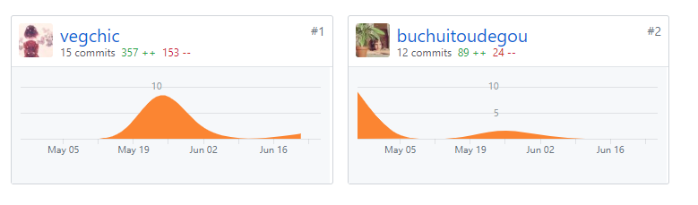

# 小组分工与贡献率说明

## PSP2.1 汇总表

| PSP阶段                    | vegchic | ninanshoulewozaizhe | 7cthunder | huangyt39 | Treekay | ChaosCodes | leiysky | buchuitoudegou |
| -------------------------- | :-----: | :-----------------: | :-------: | :-------: | :-----: | :--------: | :-----: | :------------: |
| 计划                       |    2    |          4          |     2     |     2     |    2    |     5      |    2    |       2        |
| · 估计任务时间             |    2    |          4          |     2     |     2     |    2    |     5      |    2    |       2        |
| 开发                       |   127   |         137         |    95     |    35     |   35    |     98     |   85    |      127       |
| · 分析需求                 |   16    |         16          |     8     |     3     |   10    |     20     |   20    |       15       |
| · 生成设计文档             |   16    |         16          |     4     |     2     |    5    |     32     |    4    |       15       |
| · 设计复审                 |    0    |          1          |     2     |     4     |    5    |     5      |    4    |       0        |
| · 代码规范                 |    1    |          1          |     2     |     3     |    2    |     4      |    5    |       3        |
| · 具体设计                 |    4    |          6          |     4     |     4     |    4    |     10     |   10    |       4        |
| · 具体编码                 |   90    |         90          |    60     |    10     |    0    |     20     |   30    |       90       |
| · 代码复审                 |    0    |          2          |    15     |     5     |    4    |     5      |   10    |       0        |
| · 测试                     |    0    |          5          |     0     |     0     |    0    |     2      |    2    |       0        |
| 报告                       |    2    |          2          |     2     |     2     |    5    |     5      |    2    |       2        |
| · 测试报告                 |    0    |          0          |     0     |     0     |    0    |     0      |    0    |       0        |
| · 计算工作量               |    2    |          2          |     2     |     2     |    5    |     5      |    2    |       2        |
| 事后总结，提出过程改进计划 |    2    |          1          |     2     |     2     |    2    |     2      |    2    |       2        |
| **合计**                   |   133   |         144         |    101    |    31     |   43    |    110     |   91    |      133       |

## 仓库贡献度

Dashboard：

* 这里因为 ChaosCodes 在编写文档的时候没有用自己的 github 账号而是实习的开发临时账号附上 commit 图。

  

前端：

前端原型：

后端：

后端数据库

## 综合贡献度分配

| 制品       |                       | vegchic | ninanshoulewozaizhe | 7cthunder | huangyt39 | Treekay | ChaosCodes | leiysky | buchuitoudegou |
| ---------- | --------------------- | :-----: | :-----------------: | :-------: | :-------: | :-----: | :--------: | :-----: | :------------: |
| 源代码     | 前端代码，Youyu-fe    |   0%    |         35%         |    30%    |     0     |    0    |     5%     |     0%    |      35%       |
|            | 后端，Youyu-se        |   30%   |          0          |     0     |    5%     |    0    |     5%     |    50%     |      10%       |
|            | 前端原型，Youyu-proto |   0%    |          0          |    80%    |     0     |    0    |     0      |     0%    |      10%       |
|            | 后端数据库，Youyu-db  |   50%   |          0          |     0     |     0     |    0    |     5%     |     5%    |      40%       |
| 分析与设计 | UI设计                |   0%    |         30%         |    60%    |     0     |    0    |     0      |      0%   |       0%       |
| 文档       | dashboard             |   20%   |         5%          |    5%     |    5%     |   10%   |    30%     |    0%     |       5%       |
| 综合贡献   |                       |   13%   |         12%         |    15%    |    9%     |   10%    |    13%     |    13%     |      15%       |
