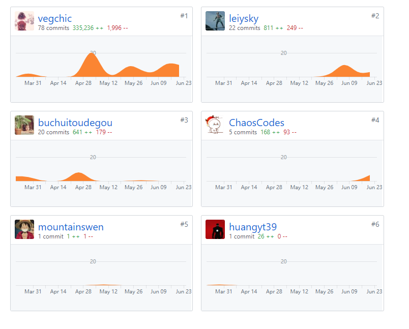

# 小组分工与贡献率说明

## PSP2.1 汇总表

| PSP阶段                    | 16340084 | 16340083 | 16340082 | 16340086 | 16340085 | 16340010 | 16340106 | 16340150 |
| -------------------------- | -------- | -------- | -------- | -------- | -------- | -------- | -------- | -------- |
| 计划                       | 2        | 4 |    2    |      2    | 2 |          |          |       2   |
| · 估计任务时间             | 2        | 4 |     2    |       2   | 2 |          |          |       2   |
| 开发                       | 127      | 137 |    95    |    35      | 35 |          |          |    127      |
| · 分析需求                 | 16       | 16 |     8    |    3      | 10 |          |          |       15   |
| · 生成设计文档             | 16       | 16 |     4   |      2    | 5 |          |          |        15  |
| · 设计复审                 | 0        | 1 |    2    |     4     | 5 |          |          |       0   |
| · 代码规范                 | 1        | 1 |    2     |    3      | 2 |          |          |        3  |
| · 具体设计                 | 4        | 6 |    4     |    4      | 4 |          |          |        4  |
| · 具体编码                 | 90       | 90 |    60     |    10      | 0 |          |          |      90    |
| · 代码复审                 | 0        | 2 |    15     |     5     | 4 |          |          |      0    |
| · 测试                     | 0        | 5 |    0     |     0     | 0 |          |          |       0   |
| 报告                       | 2        | 2 |    2     |     2     | 5 |          |          |        2  |
| ·测试报告                  | 0        | 0 |    0     |      0    | 0 |          |          |       0   |
| ·计算工作量                | 2        | 2 |    2     |     2     | 5 |          |          |      2    |
| 事后总结，提出过程改进计划 | 2        | 1 |    2     |        2  | 2 |          |          |       2   |
| **合计**                   | 133      | 144 |    101   |    31      | 43 |          |          |    133      |

## 仓库贡献度

Dashboard：

前端：

前端原型：

后端：

后端数据库

## 综合贡献度分配

| 制品       |                       | 16340084 | 16340083 | 16340082 | 16340086 | 16340085 | 16340010 | 16340106 | 16340150 |
| ---------- | --------------------- | -------- | -------- | -------- | -------- | -------- | -------- | -------- | -------- |
| 源代码     | 前端代码，Youyu-fe    | 0%       | 35% |  30%     |     0     | 0 |          |          |     35%     |
|            | 后端，Youyu-se        | 30%      | 0 |  0       |     5%     | 0 |          |          |     10%     |
|            | 前端原型，Youyu-proto | 0%       | 0 |  80%      |     0     | 0 |          |          |      10%    |
|            | 后端数据库，Youyu-db  | 50%      | 0 |   0      |     0     | 0 |          |          |      40%    |
| 分析与设计 | UI设计                | 0%       | 30% |   60%     |     0     | 0 |          |          |      0%    |
| 文档       | dashboard             | 20%      | 5% |   5%     |     5%     | 10% |          |          |     5%     |
| 综合贡献   |                       | 14%   | 12% |   14%     |      5%    | 8% |          |          |      10%    |
