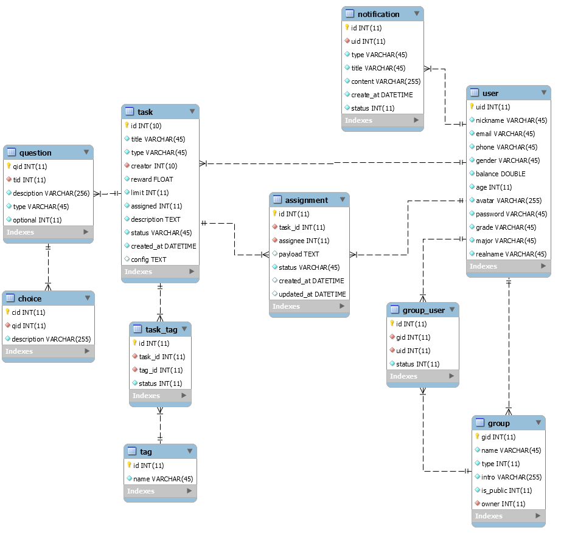

# 数据库设计


## ER 图




## DDL


### User

用户表

```sql
CREATE TABLE `user` (
  `uid` int(11) NOT NULL AUTO_INCREMENT,
  `nickname` varchar(45) NOT NULL DEFAULT '小虾米',
  `email` varchar(45) NOT NULL,
  `phone` varchar(45) NOT NULL DEFAULT '',
  `gender` varchar(45) NOT NULL DEFAULT 'unknown',
  `balance` double NOT NULL DEFAULT '100',
  `age` int(11) NOT NULL DEFAULT '18',
  `avatar` varchar(255) NOT NULL DEFAULT 'default',
  `password` varchar(45) NOT NULL,
  `grade` varchar(45) NOT NULL DEFAULT '',
  `major` varchar(45) NOT NULL DEFAULT '',
  `realname` varchar(45) NOT NULL DEFAULT '',
  PRIMARY KEY (`uid`),
  UNIQUE KEY `email_UNIQUE` (`email`)
) ENGINE=InnoDB AUTO_INCREMENT=15 DEFAULT CHARSET=utf8
```


### Group

兴趣组

```sql
CREATE TABLE `group` (
  `gid` int(11) NOT NULL AUTO_INCREMENT,
  `name` varchar(45) NOT NULL,
  `type` int(11) NOT NULL DEFAULT '0',
  `intro` varchar(255) NOT NULL DEFAULT '',
  `is_public` int(11) NOT NULL DEFAULT '0',
  `owner` int(11) NOT NULL,
  PRIMARY KEY (`gid`),
  UNIQUE KEY `name_UNIQUE` (`name`),
  KEY `group_owner_fk_idx` (`owner`),
  CONSTRAINT `group_owner_fk` FOREIGN KEY (`owner`) REFERENCES `user` (`uid`) ON DELETE NO ACTION ON UPDATE NO ACTION
) ENGINE=InnoDB DEFAULT CHARSET=utf8
```


### Group_user

兴趣组和用户的关联表

```sql
CREATE TABLE `group_user` (
  `id` int(11) NOT NULL AUTO_INCREMENT,
  `gid` int(11) NOT NULL,
  `uid` int(11) NOT NULL,
  `status` int(11) NOT NULL DEFAULT '1',
  PRIMARY KEY (`id`),
  KEY `group_id_fk_idx` (`gid`),
  KEY `user_id_fk_idx` (`uid`),
  CONSTRAINT `gu_group_id_fk` FOREIGN KEY (`gid`) REFERENCES `group` (`gid`) ON DELETE NO ACTION ON UPDATE NO ACTION,
  CONSTRAINT `gu_user_id_fk` FOREIGN KEY (`uid`) REFERENCES `user` (`uid`) ON DELETE NO ACTION ON UPDATE NO ACTION
) ENGINE=InnoDB DEFAULT CHARSET=utf8
```


### Task

任务/问卷表

```sql
CREATE TABLE `task` (
  `id` int(10) NOT NULL AUTO_INCREMENT,
  `title` varchar(45) NOT NULL,
  `type` varchar(45) NOT NULL,
  `creator` int(10) NOT NULL,
  `reward` float NOT NULL DEFAULT '0',
  `limit` int(11) NOT NULL DEFAULT '0',
  `assigned` int(11) NOT NULL DEFAULT '0',
  `description` text NOT NULL,
  `status` varchar(45) NOT NULL,
  `created_at` datetime NOT NULL DEFAULT CURRENT_TIMESTAMP,
  `config` text,
  PRIMARY KEY (`id`),
  KEY `ibfk_task_user_creator_idx` (`creator`),
  CONSTRAINT `ibfk_task_user_creator` FOREIGN KEY (`creator`) REFERENCES `user` (`uid`) ON DELETE NO ACTION ON UPDATE NO ACTION
) ENGINE=InnoDB AUTO_INCREMENT=37 DEFAULT CHARSET=utf8
```


### Question

问卷题目表

```sql
CREATE TABLE `question` (
  `qid` int(11) NOT NULL AUTO_INCREMENT,
  `tid` int(11) NOT NULL,
  `desciption` varchar(256) NOT NULL DEFAULT '',
  `type` varchar(45) NOT NULL DEFAULT '问答题',
  `optional` int(11) NOT NULL DEFAULT '0',
  PRIMARY KEY (`qid`),
  UNIQUE KEY `tid_UNIQUE` (`tid`),
  CONSTRAINT `task_question_fk` FOREIGN KEY (`tid`) REFERENCES `task` (`id`) ON DELETE NO ACTION ON UPDATE NO ACTION
) ENGINE=InnoDB DEFAULT CHARSET=utf8
```


### Choice

题目选项表

```sql
CREATE TABLE `choice` (
  `cid` int(11) NOT NULL AUTO_INCREMENT,
  `qid` int(11) NOT NULL,
  `description` varchar(255) NOT NULL DEFAULT '',
  PRIMARY KEY (`cid`),
  KEY `option_question_fk_idx` (`qid`),
  CONSTRAINT `option_question_fk` FOREIGN KEY (`qid`) REFERENCES `question` (`qid`) ON DELETE NO ACTION ON UPDATE NO ACTION
) ENGINE=InnoDB DEFAULT CHARSET=utf8
```


### Tag

task 标签表

```sql
CREATE TABLE `tag` (
  `id` int(11) NOT NULL AUTO_INCREMENT,
  `name` varchar(45) NOT NULL,
  PRIMARY KEY (`id`)
) ENGINE=InnoDB DEFAULT CHARSET=utf8
```


### Task_tag

task 和 tag 关联表

```sql
CREATE TABLE `task_tag` (
  `id` int(11) NOT NULL AUTO_INCREMENT,
  `task_id` int(11) NOT NULL,
  `tag_id` int(11) NOT NULL,
  `status` int(11) NOT NULL DEFAULT '0',
  PRIMARY KEY (`id`),
  KEY `tag_ref_fk_idx` (`tag_id`),
  KEY `task_ref_fk_idx` (`task_id`),
  CONSTRAINT `tag_ref_fk` FOREIGN KEY (`tag_id`) REFERENCES `tag` (`id`) ON DELETE NO ACTION ON UPDATE NO ACTION,
  CONSTRAINT `task_ref_fk` FOREIGN KEY (`task_id`) REFERENCES `task` (`id`) ON DELETE NO ACTION ON UPDATE NO ACTION
) ENGINE=InnoDB DEFAULT CHARSET=utf8
```


### Assignment

task 和认领者（答题者）的关联表

```sql
CREATE TABLE `assignment` (
  `id` int(11) NOT NULL AUTO_INCREMENT,
  `task_id` int(11) NOT NULL,
  `assignee` int(11) NOT NULL,
  `payload` text,
  `status` varchar(45) NOT NULL,
  `created_at` datetime DEFAULT CURRENT_TIMESTAMP,
  `updated_at` datetime DEFAULT CURRENT_TIMESTAMP,
  PRIMARY KEY (`id`),
  UNIQUE KEY `uniq_assgn_assignee_task` (`task_id`,`assignee`),
  KEY `ibfk_assgn_task_idx` (`task_id`),
  KEY `ibfk_assgn_user_idx` (`assignee`),
  CONSTRAINT `ibfk_assgn_task` FOREIGN KEY (`task_id`) REFERENCES `task` (`id`) ON DELETE NO ACTION ON UPDATE NO ACTION,
  CONSTRAINT `ibfk_assgn_user` FOREIGN KEY (`assignee`) REFERENCES `user` (`uid`) ON DELETE NO ACTION ON UPDATE NO ACTION
) ENGINE=InnoDB AUTO_INCREMENT=46 DEFAULT CHARSET=utf8
```


### Notification

通知表

```sql
CREATE TABLE `notification` (
  `id` int(11) NOT NULL AUTO_INCREMENT,
  `uid` int(11) NOT NULL,
  `type` varchar(45) NOT NULL DEFAULT 'unkown',
  `title` varchar(45) NOT NULL,
  `content` varchar(255) NOT NULL DEFAULT '',
  `create_at` datetime NOT NULL DEFAULT CURRENT_TIMESTAMP,
  `status` int(11) NOT NULL DEFAULT '0',
  PRIMARY KEY (`id`),
  KEY `user_notification_idx` (`uid`),
  CONSTRAINT `user_notification_fk` FOREIGN KEY (`uid`) REFERENCES `user` (`uid`) ON DELETE NO ACTION ON UPDATE NO ACTION
) ENGINE=InnoDB DEFAULT CHARSET=utf8
```

