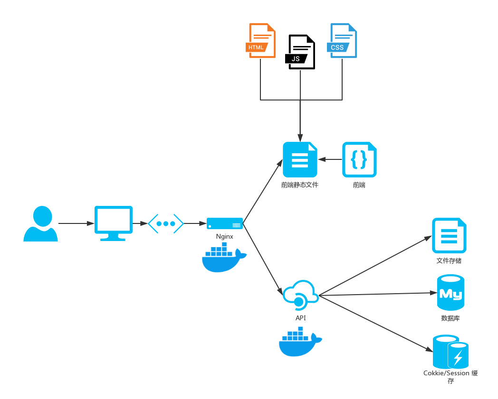

# 软件设计文档


## 技术选型理由

### 前端

#### 形式

一共有三种方案：App、Web与小程序

* App：在移动端上能得到最好的用户体验，但对新用户来说安装一个新App的成本较高。
* Web：相比App来说，Web更加轻量，不需要用户安装额外的应用。但由于浏览器厂家、版本等不同带来的兼容性问题为开发带来了难度，而且通常Web端的流畅度体验一般不佳。
* 小程序：小程序是基于微信的一种服务形式，体验比起Web更接近原生应用。而且基于用户基本都安装有、且已打开微信的场景，省去了用户安装App的时间成本，更加方便。

##### 最终选择

对三种形式的优缺点以及团队技术栈进行考虑分析，最终选择Web作为我们主开发路线，后期如有时间再开发小程序版本。

#### 框架

目前Web的话单页面应用（SPA）比较流行，其中三个很火的框架：React、Vue 和 Augular。

* React：React + Redux的搭配加上不可变的数据减少了出 bug 的可行性，但 jsx 里代码与 HTML 耦合程度较高。
* Vue：MVVM 模式，组件化开发，通过 setter 与 getter 以及 VDOM 提供了较好的性能。而且其文档更完整。
* Angular：MVC 模式，有依赖注入等优势，但脏值检查性能较差。

##### 最终选择

基于开发难度与社区活力，我们选择 Vue 进行 SPA 应用开发。


### 后端

#### ① 语言选择

##### 候选

- C/C++

  C 语言虽然是非常贴近操作系统的语言，能和操作系统 API 很好的交互，但是 C 语言并没有现代化工程开发所需要的诸如面向对象等重要功能。

  C++ 具有现代化工程开发所需要的各种功能，同时也像C一样能方便的与操作系统 API 交互，但是它同样有缺点：

  - 缺乏字符串处理，Web 开发最主要的就是字符串的处理，所有的一切几乎都要和字符串打交道。但是 C++ 只有 std::string 标准库提供的字符串类，缺乏方便的 UTF-8 和正则表达式匹配支持等。
  - 缺乏 Web 标准的支持，即语言层面上缺乏对 HTTP 协议的支持。Web 是基于 HTTP 协议和 TCP 协议产生的。而 C++ 极度缺乏这方面的支持，只能自己手工处理 Socket 通信。
  - 缺乏 HTTP 框架和业务代码之间的交互标准，框架就算完成了 HTTP 通信部分，也没有一个标准规定框架如何和业务代码交互。不过，实际上 C++ 框架是实现自己的交互流程。但是缺乏规范则是框架稀少的原因。

- Java

  Java 的效率相对于 C/C++ 这种手动管理内存的语言来说是低的，哪怕使用了引用计数，C/C++ 在性能上也远超过 Java。但是 Java 相对于其他脚本语言来说优势非常明显：

  - 强类型、编译型语言，这点就使得 Java 在效率远超动态类型语言，而且在编译时就能发现 bug，不需要等到运行时再去调试，现在的很多 IDE 也能做静态语言分析，不需要编译就能发现语法错误，这就能提升效率。
  - Java SE 规范，这让 Java 即能像 C/C++ 一样贴近操作系统，又自由处理网络相关、IO 相关的内容，功能很强大。
  - Java EE 规范，完善的规范使得 Java 后端发展有了很好的规范基础。统一的环境、规范让框架和业务代码有了交互的标准。
  - Java 有着最完善的生态链，无论是框架还是编译工具链，模块系统做的非常棒，现代工程所需的各种设计模式都有着很好的实践。除了 Java 以外，JVM 上面还有着更多的语言可以选择。

  缺点：

  - 开发效率相对较低。
  - 虽然上手开发相对容易，但真正理解框架底层的运行原理相对较难，需要大量的学习和经验。
  - Java 并没有在第一时间引入新颖的技术和语言特性。
  - 本身的规范和不够灵活也导致了代码本身很难优化，好的代码和差的代码在一套规则的束缚下实际上性能并没有多少差距，更多的优化被交给了 JVM。

- PHP

  PHP 作为一门脚本语言，本身运行效率确实不是很高，但是在 PHP7 平台上，已经算是脚本语言中比较高的了，而且在现有的硬件平台上，PHP 本身的效率基本不会成为瓶颈。它作为一门脚本语言也有着很多优势：

  - 天生的模板语言，不需要学习其他的模板语言，提升了开发效率，也提升了运行效率。
  - 上手容易，生态链也很不错，LAMP、LNMP 这样部署的技术非常普及，学习成本较低。

  缺点：

  - 解释型语言，运行效率低，且无法常驻内存。
  - 缺乏好用的包管理和命名空间，也缺乏好用的模块系统 。

- Node.js

  Node.js 作为目前比较火热的语言，确实有它的独到之处，这里先列举它的优点：

  - 事件循环 + 异步 IO，使 Node.js 在IO性能上有极其优秀的表现。
  - JavaScript 易上手，且有着活跃的社区和很多的第三方库。
  - 使用 NPM 这一优秀的包管理工具。
  - 前端使用 JavaScript，Node.js 能做到全栈开发。

  缺点：

  - 默认单进程，单线程，只支持单核CPU，不能充分的利用多核CPU服务器资源。
  - 动态语言，可靠性低，调试困难。许多错误只有在运行时才能发现。

- Python

  Python 入门简单，并且经过长期发展，各种 Web 框架环境非常成熟，主要的一些框架，其接口和用法相对较为稳定，资料也非常丰富。

  优点：

  - 学习简单，能快速进行开发构建 Web 应用。
  - 拥有丰富的标准库和第三方库。
  - 在WEB方面有多种成熟的框架。

  缺点：

  - 作为解释型语言，运行速度较慢，且无法有效利用多线程。
  - 包管理工具和语言升级带来的混乱，且部署工具生态混乱。
  - 缺少有效的性能分析和调试工具。

- Go

  Golang 的设计理念很明确，就是将动态类型语言的编程容易度和静态类型语言的安全效率结合起来。

  优点：

  - 部署简单，Go 编译生成的可执行文件无需担心包和库的依赖关系。
  - 并发性能好，即使是单个Go应用也能有效利用多个 CPU 核心。
  - 良好的语言设计，且自带完善的工具链。
  - 性价比高，在编译型语言的运行性能和动态语言的开发效率间平衡的很好。

  缺点:

  - import 的包不支持自定义版本，项目容易因为包的升级而不可用。
  - 暂时缺乏比较完善的框架。

##### 考虑要素

- 技术

  选型在技术层面，主要考虑语言的可用框架、工具、设计模式、开发模式等部分。主要有两个原则：取长避短、关注发展前景。

  从上面的提名语言中可以看出，C/C++ 在框架和工具上考虑，适不适合作为本次后端的开发语言。

  Go 虽然有着良好的性能和完善的工具链，且有着良好的发展前景，且本身语言生态好，发展的比较完善，以前存在的 GC 问题也逐渐改善。

- 业务

  结合众包这个业务需求，我们可以发现这个场景主要特点是容错率低，伴随有大量的数据存储，为了方便开发，Python，Nodejs 等弱类型语言都不是最佳选择，而 Go 即是强类型，也有一些其他强类型语言不具备的便利，适合快速的业务开发。

- 开发人员

  从团队技术栈的角度出发，团队成员比较熟悉的开发语言是 Go。

##### 最终选择

基于上述三个因素的考量，最终我们选择 Go 作为后端编程语言。

- Go 社区活跃，工具链完整，开发敏捷，对JSON支持良好符合技术相关要求。
- Go 编译型的语言速度能达到预期要求。
- Go 学习成本较低，且开发人员相对熟悉，能够快速进行上手开发。

#### ② 框架选择

Go 流行的Web开发框架：

- **Beego**：Go编程语言的开源，高性能Web框架。
  - [https://github.com/astaxie/beego](https://github.com/astaxie/beego)
  - [https://beego.me](https://beego.me/)

- **Buffalo**：快速Web开发w/Go。
  - [https://github.com/gobuffalo/buffalo](https://github.com/gobuffalo/buffalo)
  - [https://gobuffalo.io](https://gobuffalo.io/)

- **Echo**：高性能，极简主义的Go Web框架。
  - [https://github.com/labstack/echo](https://github.com/labstack/echo)
  - [https://echo.labstack.com](https://echo.labstack.com/)

- **Gin**：用Go（Golang）编写的HTTP Web框架。它具有类似Martini的API，具有更好的性能。
  - [https://github.com/gin-gonic/gin](https://github.com/gin-gonic/gin)
  - [https://gin-gonic.github.io/gin](https://gin-gonic.github.io/gin)

- **Iris**：Go in the Universe中最快的Web框架。MVC功能齐全。今天拥抱未来。
  - [https://github.com/kataras/iris](https://github.com/kataras/iris)
  - [https://iris-go.com](https://iris-go.com/)

- **Revel**：Go语言的高生产力，全栈Web框架。
  - [https://github.com/revel/revel](https://github.com/revel/revel)
  - [https://revel.github.io](https://revel.github.io/)

经过调研和讨论，选择了 Gin 为项目框架，因为其具备中文文档，易用的 API，以及大量资料，能帮助开发人员快速上手。


## 架构设计



### 系统基本架构

- Web 作为前端与用户交互
- 前端通过 HTTP 与后端沟通
- Nginx 捕获 HTTP 请求并进行反代，将请求转发到相应服务器
- 服务器通过内存维护 Session
- 使用 MySQL 作为数据库

### 部署细节

- MySQL 直接用实例部署
- Nginx 与 Server 均通过 Docker Compose 编排


## 模块划分

### 前端

* VueJS
  * 可复用组件
  * 页面
* Vue-Router
  * 前端路由
* Vuex
  * 全局状态管理
* Axios
  * 网络请求


### 后端

- router

  负责将 HTTP 请求转交给合适的 controller 处理，同时还负责了鉴权

- controller

  处理 HTTP 请求，收集参数，进行简单的参数格式验证，并调用 models

- model

  负责与数据库的交互


## 模块内设计

### 前端

#### VueJS

组件树如下：

```
└─App：挂载整个应用
   ├─ErrorModal: 全局错误提示框组件
   ├─auth:【权限界面】
   │  ├─Login:【登录界面】
   │  ├─Register:【注册界面】
   │  └─Modal: 权限界面提示框组件
   └─main:【主界面】
      ├─SideMenu: 主界面导航组件
      ├─TopLine: 主界面顶部组件
      ├─Main: 【概览界面】
      ├─RequestHall: 请求大厅
      │  ├─InformationRetrievalBar: 请求页面信息导航组件
      │  ├─RequestCard: 请求简介组件
      │  └─PageSwitcher: 换页组件
      ├─PersonalPage: 【个人中心页面】
      ├─AssignmentPage: 【我的请求页面】
      │  ├─ReceivedAssignmentPage: 【已接受的请求页面】
      │  │  ├─InformationRetrievalBar: 请求页面信息导航组件
      │  │  ├─RequestTable: 已接受请求的表格组件
      │  │  └─PageSwitcher: 换页组件
      │  ├─PublishedAssignmentPage: 【已发送的请求页面】
      │  │  ├─InformationRetrievalBar: 请求页面信息导航组件
      │  │  ├─RequestTable: 已发送请求的表格组件
      │  │  └─PageSwitcher: 换页组件
      │  └─AssignmentStatisticsPage: 【问卷统计页面】
      └─PublishPage: 【发布请求页面】
         ├─PublishQuestionnairePage:【发布问卷页面】
         |  └─QuestionCreater: 问题添加组件 
         └─PublishTaskPage: 【发布自定义任务页面】
            └─AttachmentUpload: 附件上传组件
```

#### Vuex：

- Mutation：定义了对`State`中数据的修改操作。组件使用`State`中的数据的时候并不能直接对数据进行修改操作，需要调用`Mutation`定义的操作来实现对数据的修改。这也是Vuex定义中所说的用相应的规则来让数据发生变化的具体实现。
- Action：`Mutation`中定义的操作只能执行同步操作，Vuex中的异步操作在`Action`中进行，`Action`最终通过调用`Mutation`的操作来更新数据
- Module：`Store`和`State`之间的一层，便于大型项目管理，`Store`包含多个`Module`，`Module`包含`State`、`Mutation`和`Action`


### 后端

- router

  router 的鉴权和路由

  ```go
  // auth api
  api.PUT("/login", controllers.LoginHandler)
  api.POST("/register", controllers.RegisterHandler)
  
  // login middleware
  api.Use(loginRequired())
  ```

- controller

  业务的逻辑

  ```go
  // get assignment list
  func GetAssignList(c *gin.Context) {
  	user := c.MustGet("user").(models.User)
  	assignlist := models.GetAssignmentListByUid(user.Uid)
  	c.JSON(200, gin.H{
  		"data": assignlist,
  		"msg":  "OK",
  	})
  }
  ```

- model

  model 与数据库交互

  ```go
  func GetTaskListByCreator(creator int) []Task {
  	var taskList []Task
  	if err := DB.Find(&taskList, Task{Creator: creator}).Error; err != nil {
  		if !gorm.IsRecordNotFoundError(err) {
  			panic(err)
  		}
  	}
  	return taskList
  }
  ```


## 技术与实现

### Docker编排

Nginx 和 Server 采用 Docker Compose 进行编排，Server 定义文件为 `docker/docker-compose.yml`

大致如下

```yml
version: '3'
services:
  web:
    container_name: youyu-se
    image: golang:latest
    working_dir: /go/src/github.com/surplus-youyu/Youyu-se
    command: go run -mod=vendor main.go
    env_file:
      - .env
    ports:
      - "8888:8080"
    volumes:
      - ..:/go/src/github.com/surplus-youyu/Youyu-se 
```


### 持续集成、测试与部署

Server 使用 Travis-CI 进行持续集成、测试与部署，定义文件为`.travis.yml`

大致如下：

```yml
language: go

go:
  - 1.12.x

addons:
  ssh_known_hosts:
    - "$server_ip"

env:
  - GO111MODULE=on

before_install:
  - openssl aes-256-cbc -K $encrypted_f33d63438573_key -iv $encrypted_f33d63438573_iv 
    -in .travis/id_rsa.enc -out ~/.ssh/id_rsa -d
  - chmod 600 ~/.ssh/id_rsa

script:
  - go build -mod=vendor
  - diff -u <(echo -n) <(gofmt -d $(find . -type f -name "*.go" ! -path "./vendor/*"))
  - go test -v ./...

after_success:
  - test $TRAVIS_BRANCH = "master" && test $TRAVIS_PULL_REQUEST = "false" && ssh travis@$server_ip -o StrictHostKeyChecking=no "bash ~/Youyu-se/.travis/deploy.sh"
```


部署脚本如下：

```bash
#!/bin/bash
set -ex

cd ~/Youyu-se/
git fetch && git rebase origin/master 
docker-compose -f docker/docker-compose.yml restart 
```


这里主要做的是静态检查以及通过 SSH 免密登录实现远程自动部署。


### 编程风格

**代码规范**

- [后端代码规范](se-code-style-guide.md)
- [前端代码规范](fe-code-style-guide.md)
