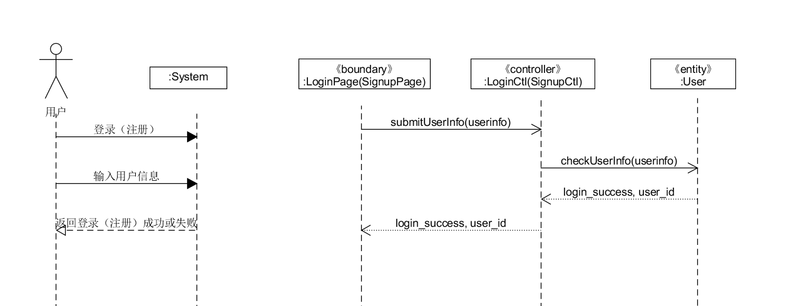
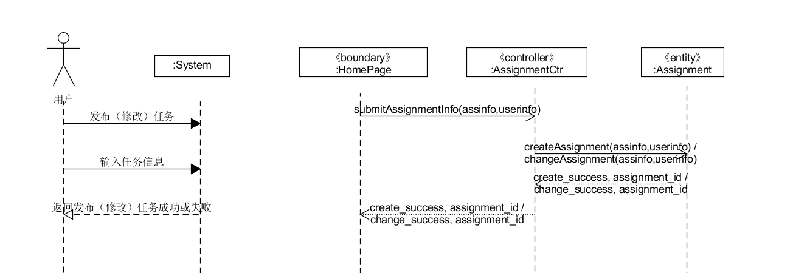
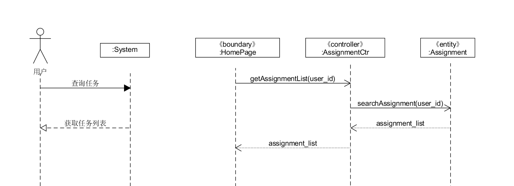
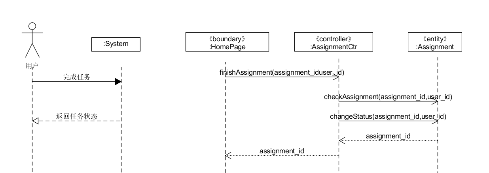
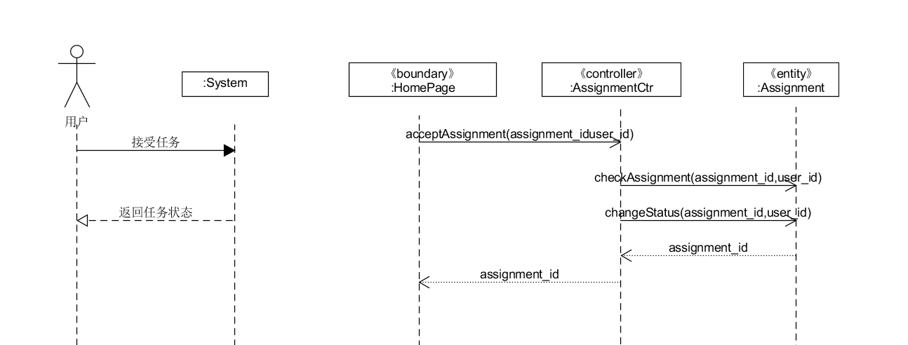
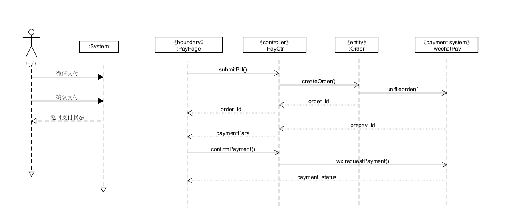

# Use Case Diagram（用例设计）

# 用例图

根据[用例分析](https://surplus-youyu.github.io/Dashboard/docs/use-cases.html)

### 基本功能

1.注册与登录

2.发布任务

3.查询任务

4.完成任务

5.接受任务

6.用户充值与提现

用户可以发布、接受任务，从而将闲钱币发给接受者或者获得闲钱币，可以进行充值和提现；用户可以查询可领取的任务和查看我的任务，也可以修改任务信息

### 系统顺序图

#### 1.注册与登录

#### 2.发布、修改任务

#### 3.查询任务

#### 4.完成任务

#### 5.接受任务

#### 6.用户充值与提现

