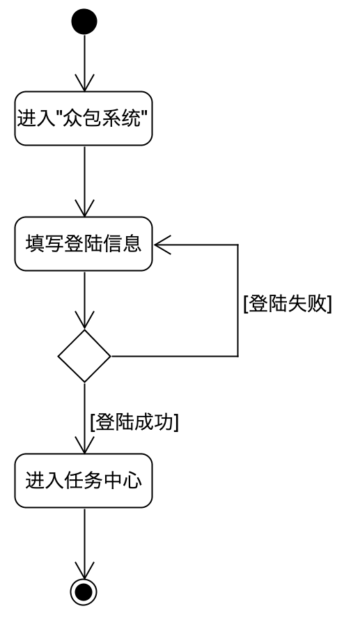
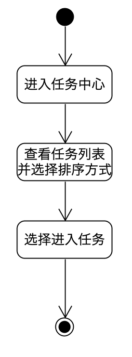
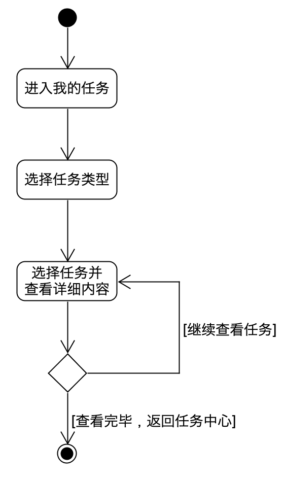
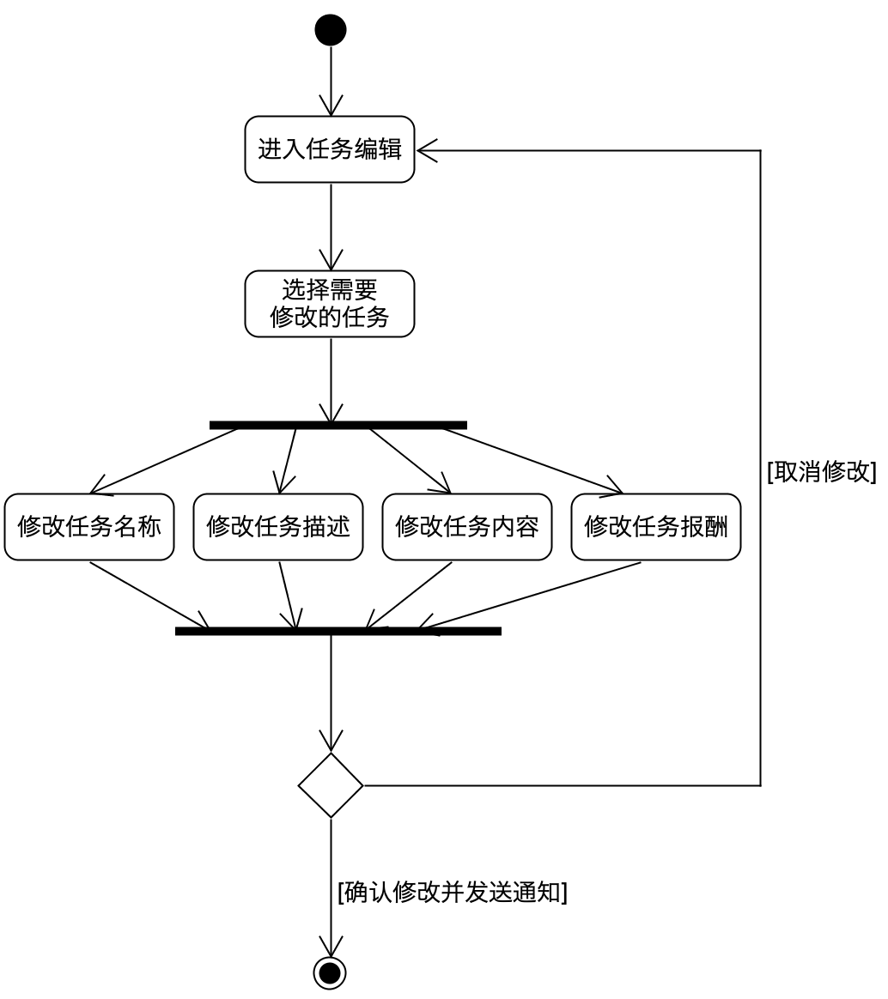
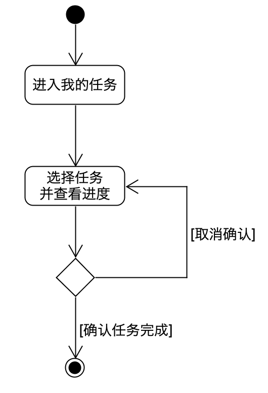
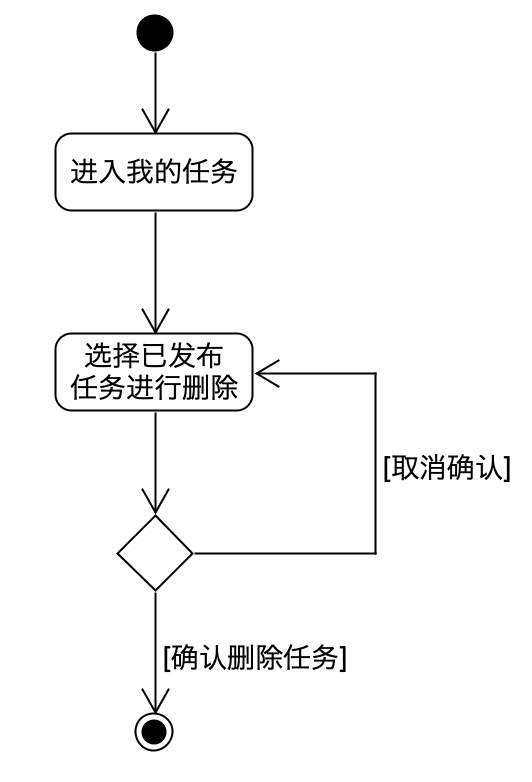
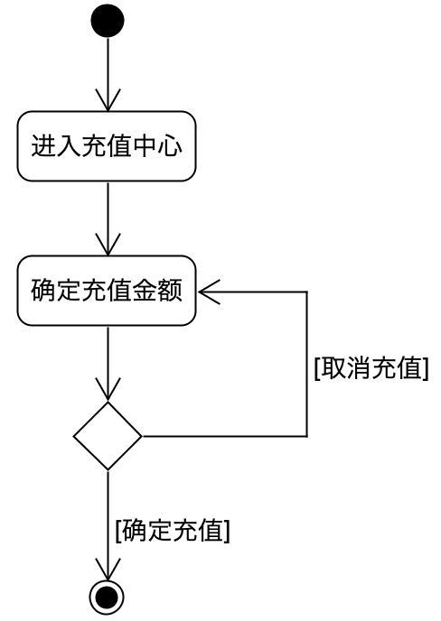
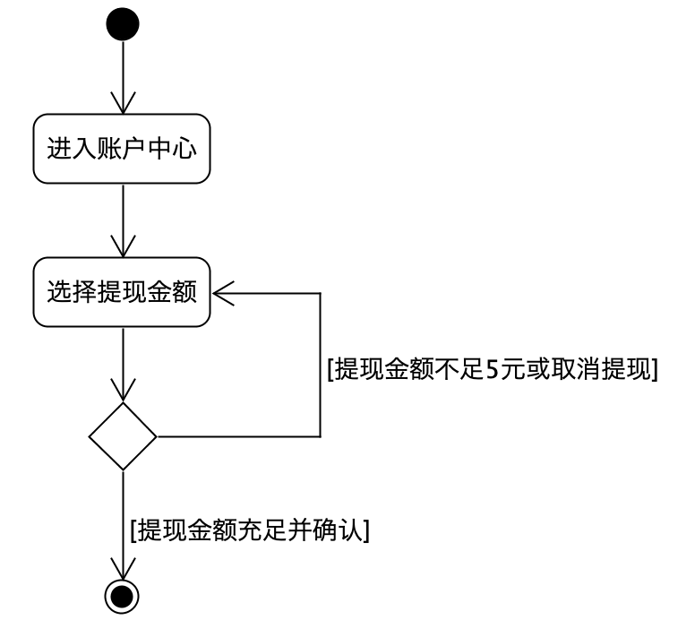

### 摘要用例

#### UC1 注册用户

- Actor：用户
- Type：Primary
- Description：用户想要使用该"众包"系统，登录我们的网站，进入注册界面，填写相关信息，完成注册。

#### UC2 发布任务

- Actor：用户
- Type：Primary
- Description：用户根据自己的需求，选择任务的种类，并且详细填写任务的内容，如自定义任务则要写明需要的目标；而如果是问卷的任务则需要仔细填写相应的问题并给出一定的报酬。当用户完成任务的自定义后，可以提交任务并且发放到任务大厅中。

### 非正式用例

#### UC3 用户登陆

参与者：用户

目的：用户登陆

概要：用户通过注册的账号登陆众包系统，并且进入任务中心。

类型：基础 重要

活动图：

#### UC4 查询可领取任务

参与者：用户

目的：用户查看当前可领取任务。

概要：用户进入任务大厅，可以根据筛选，各种排序查看现有可领取的任务。

类型：基础 重要

活动图：

#### UC5 查询当前用户的任务

参与者：用户

目的：用户选择当前与自己有关（接受、发布）的任务。

概要：服务器向用户返回当前与用户有关的任务，用户可以选择查看已接受的任务或者是已发布的任务来看任务的详细内容。

类型：基础 重要

活动图：

#### UC6 修改任务信息

参与者：用户（发布任务者）

目的：发布任务者修改任务内容。

概要：用户在查看自己发布任务的页面上，可以修改任务的内容，修改完成后会通知已接受的用户。

类型：基础 重要

活动图：

#### UC7 完成任务

参与者：用户

目的：发布任务者或领取任务者确认任务内容。

概要：用户在查看任务进行情况并确认任务完成。

类型：基础 重要

活动图：

#### UC8 取消任务

参与者：用户（发布任务者）

目的：发布任务者删除放弃已发布任务。

概要：用户取消已发布的任务。

类型：基础 重要

活动图：

 

#### UC9 用户充值

参与者：用户

目的：用户进行充值，得到 Youyu 币

概要：用户进行充值，获取 Youyu 币来给任务添加报酬。

类型：基础 重要

#### UC10 用户提现

参与者：用户

目的：用户利用 Youyu 币进行提现

概要：用户进行提现，将 Youyu 币换为 RMB

类型：基础 重要

### 详述用例：UC11 用户接受任务

#### 范围

Youyu 众包系统

#### 级别

用户目标

#### 主要参与者

接受任务者（用户）

#### 涉众及其关注点

- 接受任务者：通过在任务大厅查找可接受任务，然后领取任务。
- 发布任务人员：发布任务，并且可以及时知道接受任务的信息。

#### 前置条件

无

#### 后置条件

存储用户领取信息，通知发布任务者

#### 主成功场景

1. 用户登陆进入任务大厅
2. 用户浏览任务大厅并选择青睐的任务
3. 用户了解任务内容，进行领取
4. 用户完成任务，等待发布任务者确认
5. 用户得到报酬，任务完成

#### 扩展

1. 用户在领取任务的时候会给发布任务者发送通知信息。

#### 特殊需求

- 系统的平均响应时间低于10秒
- 系统必须可靠，使用者几乎不需要关心系统的失败问题
- 系统要有一定的安全性
- 任务内容要支持图片。

#### 发生频率

非常高

#### 未决问题

- 系统的可靠性如何保障？
- 系统的实时响应如何保障？
- 系统的安全性如何保障？