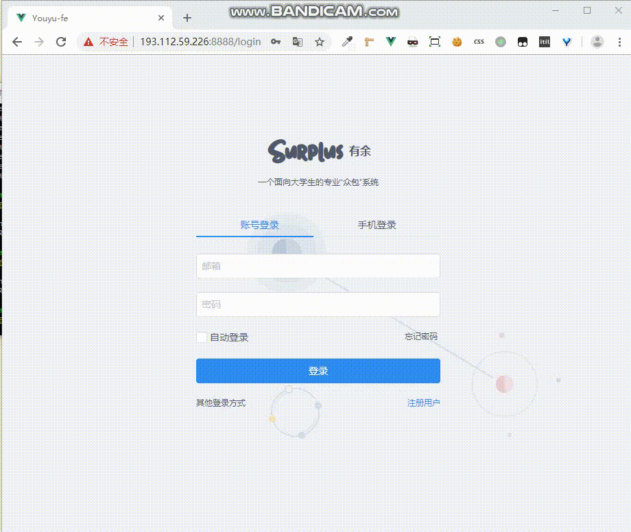
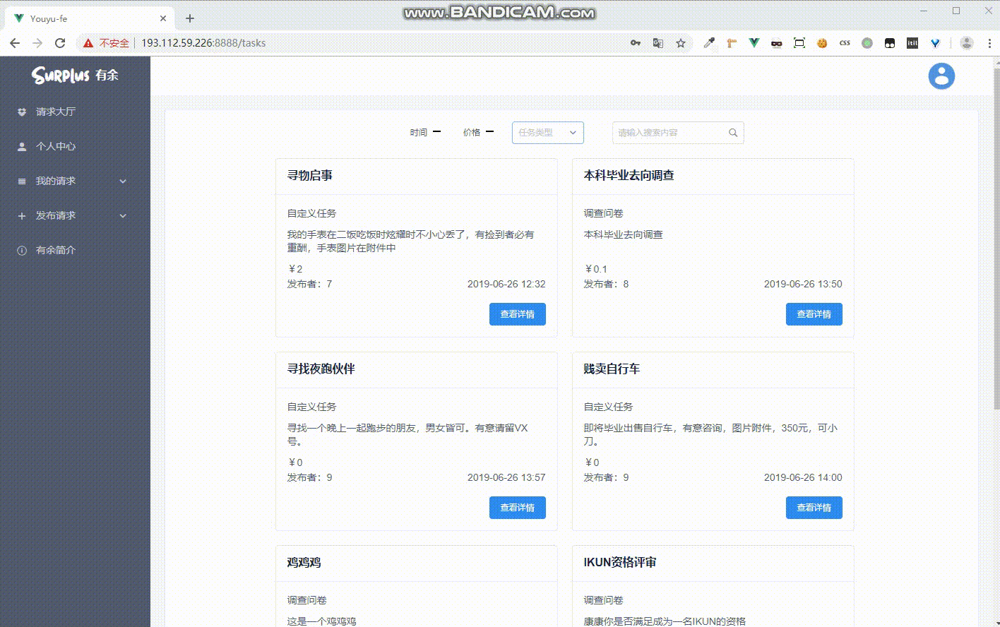
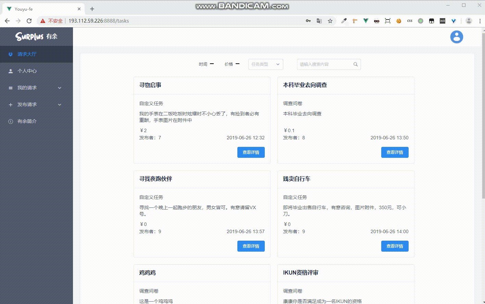
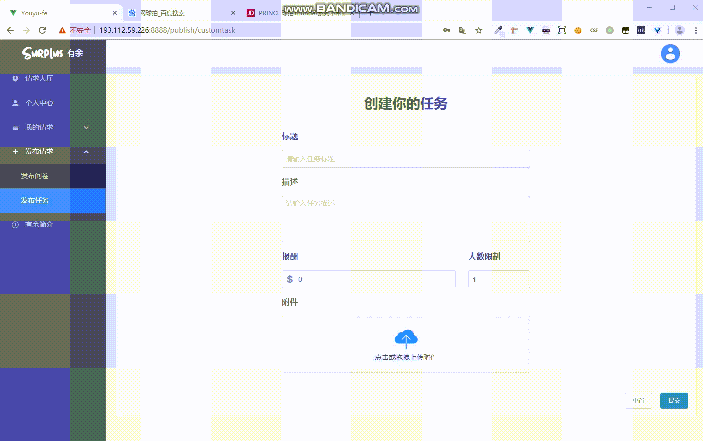
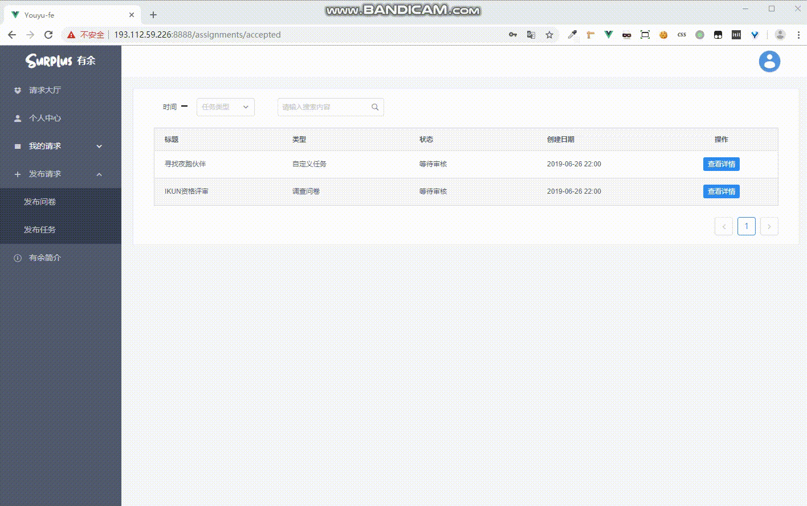
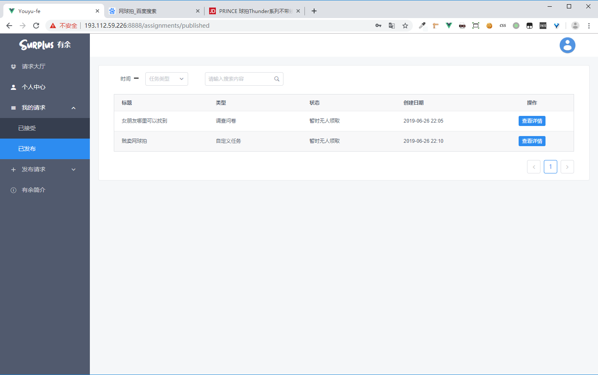
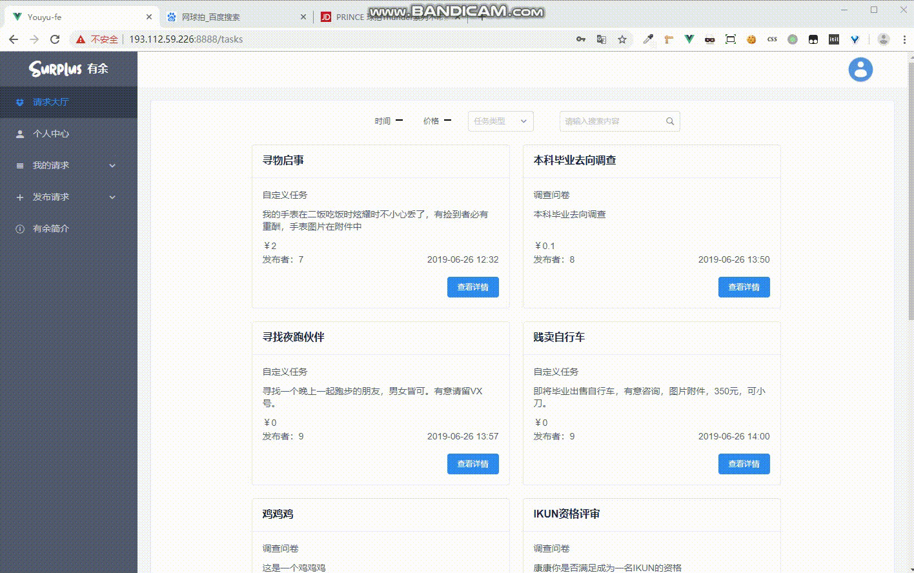

# 有余使用说明

本项目为web应用，服务器已经部署好，在浏览器打开[http://193.112.59.226:8888](http://193.112.59.226:8888/)即用。

首先是注册登录，

登录成功进入请求大厅，可以看到请求列表，请求列表可以根据时间、价格、任务类型分类排序，可以根据任务标题进行搜索。

点击任务查看详情可了解详情，并选择接受与否。

接受任务后可在我的请求中进行查询任务状态和详情，任务完成时则需等待发布者审核。

发布自定义任务。

发布问卷。

在已发布中可查看发布过的任务、问卷。

在个人中心可以查看、更改自己的个人信息。

在发布的任务、问卷中，可以查看其完成情况和统计情况。

