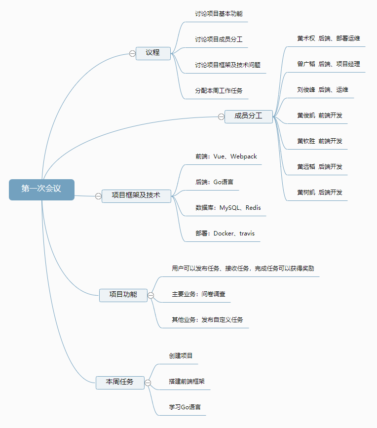

# 项目启动会议会议

Week5 - 2019/03/30

#### 会议议程

* 确定项目基本业务功能
  * 用户可以发布任务、接受任务，完成任务可以获得应用上的虚拟金币奖励
  * 主要业务：发布问卷调查，填写问卷获得奖励
  * 其他业务：用户自定义任务，完成任务并提供图片证明可以获得奖励
* 明确成员分工
  * 前端、后端、部署运维、产品
* 讨论项目框架及技术
  * 前端：Vue、webpack
  * 后端：Go、MySQL、Redis、Docker

#### 会议结果

* 前端实现：Web应用，视工作情况再决定是否开发小程序
* 后端实现：Go语言作为服务端开发语言，数据库用MySQL、Redis，用Docker部署
* 技术难点：问卷创建页面的前端实现，数据库如何建表存储用户信息和任务记录，问卷反馈页面如何通过API拿到数据并使用

#### 工作安排

* 创建项目
* 搭建前端框架
* 开发部分主要前端页面
* 学习Go语言，了解Go后端开发框架
* 项目调研，功能需求分析

#### 会议记录

