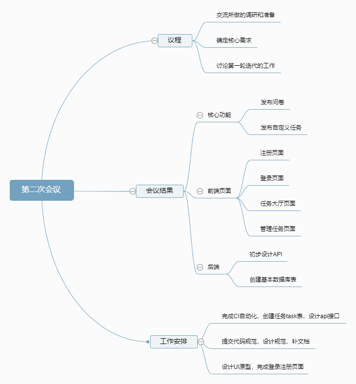
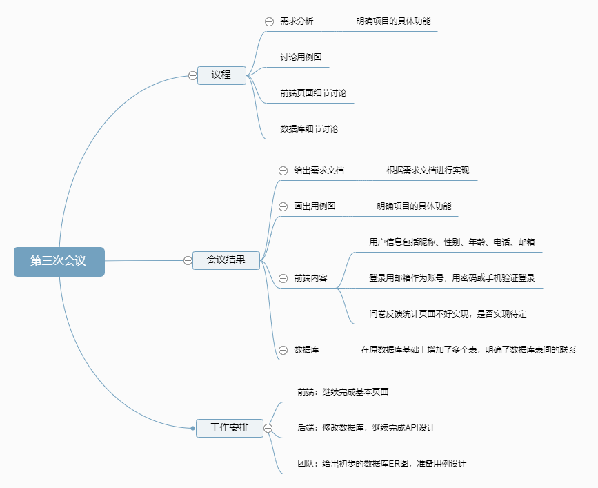

# 第一次迭代会议

## Week6 - 2019/04/07

### **会议议程**

1. 交流所做的调研和准备
2. 确定核心需求，为需求分析工作做准备

3. 讨论第一轮迭代阶段的任务

### **会议结果**

* 核心功能：发布问卷，完成问卷自动获得奖励；发布自定义任务，完成任务后上传图片由发布者认证发布奖励
* 前端基本页面：注册、登录页面，任务大厅页面，创建任务页面
* 还需要创建问卷页面的页面，以及填写问卷的页面问卷发布者要能查看问卷的统计结果
* 后端初步设计登录、注册，管理任务的API接口
  * 数据库创建用户user表存储用户信息，任务task表存储创建的任务	

### **工作安排**

* 前端
  * 设计UI原型
  * 完成登录注册页面
* 后端
  * CI自动化
  * 创建任务task表，设计api接口
* 团队
  * 提交前端、后端代码规范
  * 提交REST API设计规范
  * 补文档：项目规划、团队组建、项目前期调研、项目愿景

### **会议记录**

------

## Week7 - 2019/04/13

### **会议议程**

1. 需求分析，明确项目的具体功能
2. 讨论用例图
3. 前端页面细节讨论
4. 数据库设计细节讨论

### **会议结果**

* 给出需求文档，根据需求文档进行后续实现
* 画出用例图以明确应用的具体功能
* 前端内容
  * 用户信息包括昵称、性别、年龄、电话、邮箱
  * 登录用邮箱作为账号，用密码或手机验证登录
  * 问卷反馈统计页面不好实现，是否实现待定
* 数据库设计
  * 在原数据库基础上增加了多个表，明确了数据库表间的联系。

### **工作安排**

* 前端：继续完成基本页面
* 后端：修改数据库，继续完成API设计
* 团队：给出初步的数据库ER图，准备用例设计

### **会议记录**

### **用例图**

------

## Week9 - 2019/04/27

### **会议议程**

1. 登录、注册功能验收：前端Web页面、后端API
3. 分析现有的数据库结构是否合理
4. 互相对一下进度，总结第一轮迭代的工作

### **工作安排**

* 第十周是期中周加五一假期，暂不安排工作
* 继续完善前面完成的工作
* 学习相关知识，有空写写技术报告
* 补文档：产品特性库、部署说明

