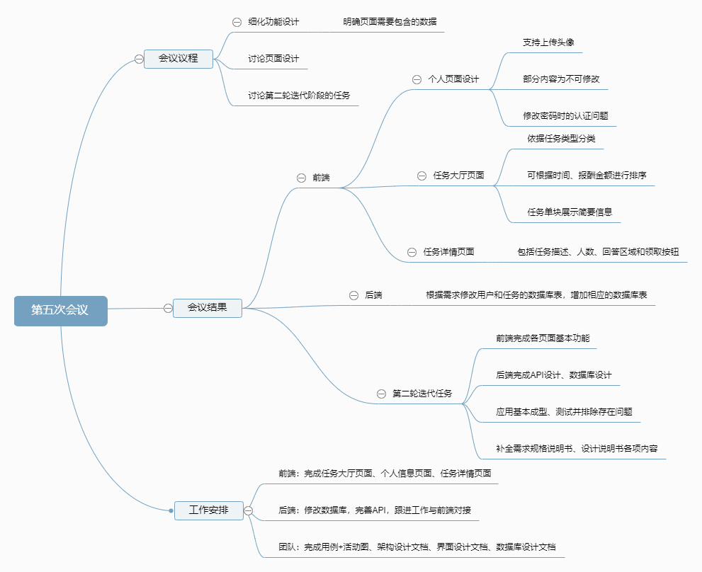
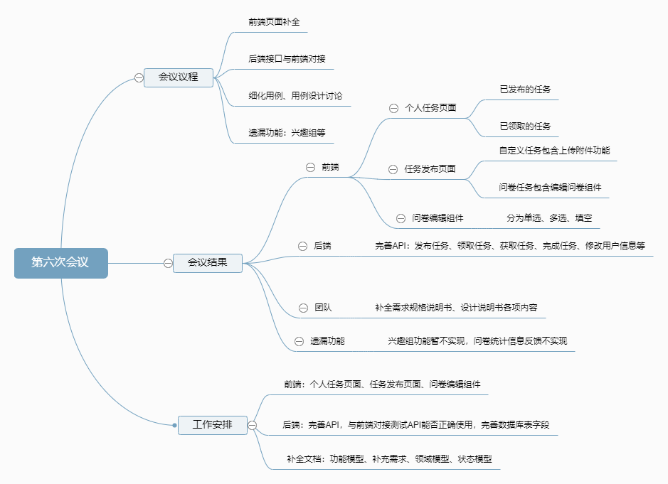

# 第二次迭代会议

## Week11 - 2019/05/11

### **会议议程**

1. 细化功能设计，明确页面需要包含的数据
2. 讨论界面设计
3. 讨论第二轮迭代阶段的任务

### **会议结果**

* 前端页面：
  * 个人页面
    * 页面内容包括：头像、昵称、性别、年龄、年级、专业、邮箱、手机、余额、修改密码
    * 其中邮箱、手机已绑定不可修改，余额不可修改
  * 任务大厅页面
    * 包括排序功能选择栏：可以按照时间、报酬、任务类型进行分类和排序；包括搜索框
    * 各任务模块组件：任务名、描述、报酬、发布者、日期、查看详情按钮
  * 任务详情页面
    * 包括任务描述、领取任务人数、回答区域、接收任务按钮
* 后端：
  * 根据需求修改用户和任务的数据库表，增加相应的数据库表

- 第二轮迭代任务：
  - 前端完成各页面基本功能
  - 后端完成API设计、数据库设计
  - 应用基本成型，测试并排除存在问题
  - 补全需求规格说明书、设计说明书各项内容

### **工作安排**

* 前端：完成任务大厅页面、个人信息页面、任务详情页面
* 后端：修改数据库，完善API，跟进工作与前端对接

- 团队：完成用例+活动图、架构设计文档、界面设计文档、数据库设计文档

### **会议记录**

------

## Week13 - 2019/05/25

### **会议议程**

1. 前端页面补全
2. 后端接口与前端对接
3. 细化用例，用例设计讨论
4. 遗漏功能：兴趣组等

### **会议结果**

* 前端页面：
  * 我的任务页面：
    - 分为已发布和已接受两栏
    - 页面内容包括任务排序方式，搜索框，任务列表
    - 每项任务的内容包括标题、任务类型、状态、创建日期以及操作按钮
  * 任务发布页面
    - 发布页面包括：标题、描述、报酬、人数限制、重置、提交按钮
    - 任务发布页面有上传附件功能
    - 问卷发布页面有调用题目添加组件的按钮
    - 题目添加组件的内容有：题目、题目类型、是否必填、以及选项
* 后端：
  * 提供发布任务、领取任务、获取任务、完成任务、修改用户信息等的API
* 团队：
  * 补全需求规格说明书、设计说明书各项内容

### **工作安排**

1. 前端：个人任务页面、任务发布页面、问卷编辑组件
2. 后端：完善API，与前端对接测试API能否正确使用，完善数据库表字段
3. 补全文档：功能模型、补充需求、领域模型、状态模型

### **会议记录**

