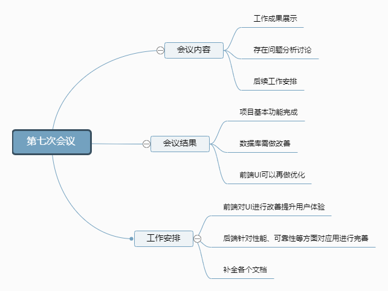

# 第三次迭代会议

## Week15 - 2019/06/08

### **会议内容**

1. 工作成果展示
2. 存在问题分析讨论
3. 后续工作安排

### **会议结果**

- 项目基本功能完成
- 数据库部分表存在多余字段，可以再做修改优化
- 前端页面部分UI需要再做修改

### **工作安排**

- 前端对UI进行改善提升用户体验
- 后端针对性能、可靠性等方面对应用进行完善
- 补全各个文档

### **会议记录**

------

## Week16 - 2019/06/15

### **会议内容**

1. 验收项目成果，测试项目功能
2. 总结汇报各项工作进度
3. 根据项目要求检查是否有遗漏

### **工作安排**

* 测试项目，排查潜在问题
* 整理补全所有文档、会议记录

