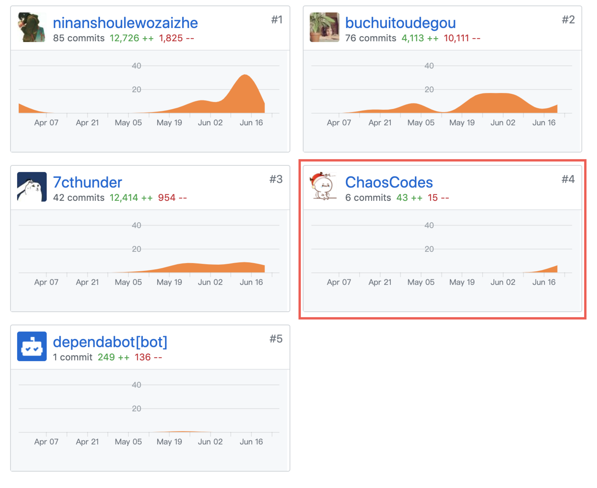
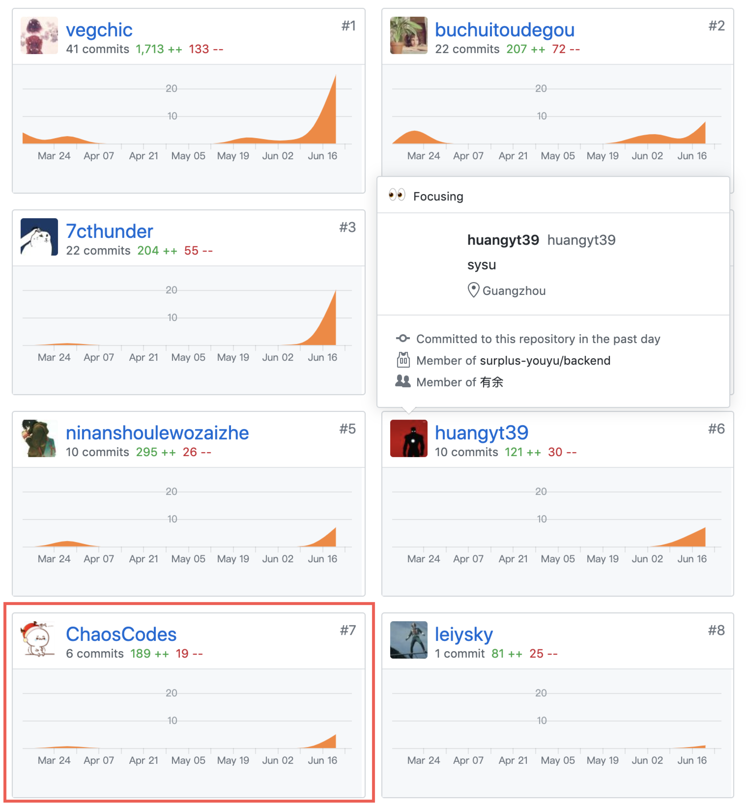
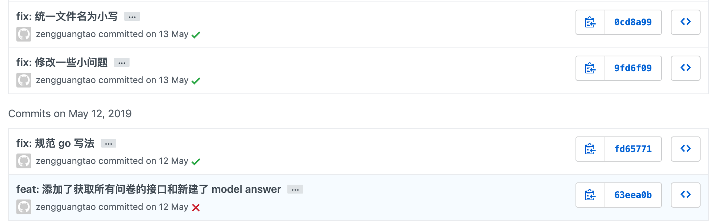

# 个人总结报告

这次项目我（@ChaosCodes）主要负责有余项目的需求分析、设计，作为项目的产品经理。

在这次团队项目开发中，首先为这个众包项目进行了命名，组织了第一次会议，并且分析了项目的需求，编制了相关的用例图，以及设计图。此外，在项目中也对整个项目进行代码审计，也给前后端补充了一些一开始没有注意到的功能以及整理了代码的规范。

同时在项目开发上，学会了在宏观上作为一个 pm 对项目的思考方式，在这次开发中真的学到了很多东西。

## PSP-2.1统计表

| PSP阶段                    | 耗时(h) |
| -------------------------- | ------- |
| 计划                       | 5       |
| · 估计任务时间             | 5       |
| 开发                       | 98      |
| · 分析需求                 | 20      |
| · 生成设计文档             | 32      |
| · 设计复审                 | 5       |
| · 代码规范                 | 4       |
| · 具体设计                 | 10      |
| · 具体编码                 | 20      |
| · 代码复审                 | 5       |
| · 测试                     | 2       |
| 报告                       | 5       |
| ·测试报告                  | 0       |
| ·计算工作量                | 5       |
| 事后总结，提出过程改进计划 | 2       |
| **合计**                   | 110     |

## 主要工作清单
* **最有价值**：帮助整个项目设计用例图，思考编写活动图，状态模型，设计数据库并且添加了领域模型。而且对市场做了一定的调查（发问卷），对目前竞品做了分析，对项目进行了调研。为团队编写了团队介绍，着力建设团队文化等

在编写需求文档的同时，也观察代码情况，对代码进行整理，在最后进行补充修饰、debug 的工作。

## 在项目相关仓库中的贡献
### Youyu-fe（前端）：

### Dashboard

* 这里因为在编写文档的时候没有用自己的 github 账号而是实习的开发临时账号附上 commit 图！！！

### Youyu-se （后端）

## 个人博客清单

[docker 学习日记](https://chaoscodes.github.io/2019/04/02/Docker学习日记-Day1/)

## 特别致谢
* 感谢所有我的队友，以及其他项目的同学为我提供帮助
