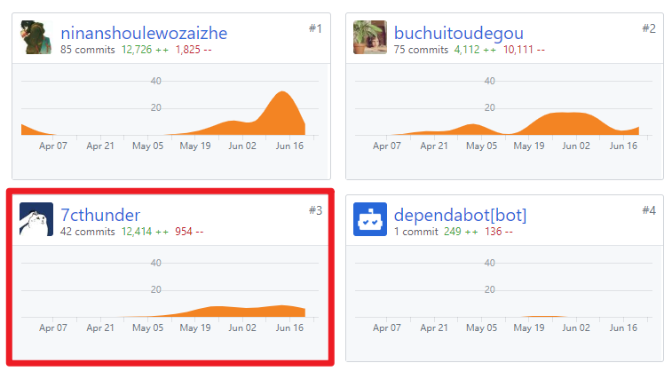
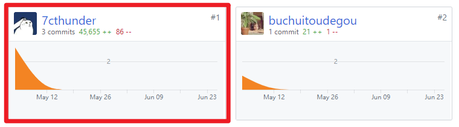

# 个人总结报告

这次项目我（@7cthunder）主要负责前端页面UI设计以及部分功能页面

在这次团队项目开发中，了解到项目的需求分析、设计是非常的重要，起先因为团队里没有UI设计师，我就兼具UI设计师和前端Vue工程师两职，我们之前的想法是只需要设计出大概风格后，前端工程师直接做即可，但这样的效果就是用户体验会不太一致，所以后面一大部分时间我都是在优化页面UI和操作逻辑

同时在项目开发上，之前一直用Vue开发一些小大小闹的玩具，对一些规范也是一无所知，在这次开发中真的学到了很多东西。

## PSP-2.1统计表

| PSP阶段                    | 耗时(h) |
| -------------------------- | ------- |
| 计划                       | 2       |
| · 估计任务时间             | 2       |
| 开发                       | 95      |
| · 分析需求                 | 8       |
| · 生成设计文档             | 4       |
| · 设计复审                 | 2       |
| · 代码规范                 | 2       |
| · 具体设计                 | 4       |
| · 具体编码                 | 60      |
| · 代码复审                 | 15      |
| · 测试                     | 0       |
| 报告                       | 2       |
| ·测试报告                  | 0       |
| ·计算工作量                | 2       |
| 事后总结，提出过程改进计划 | 2       |
| **合计**                   | 101     |

## 主要工作清单
* **最有价值**：帮助前端团队在开发的过程中不断地优化UI

## 在项目相关仓库中的贡献
Youyu-fe（前端）：

Youyu-proto（UI）:

## 个人博客清单
[Swagger & Mock](https://7cthunder.github.io/2019/06/23/Swagger-Mock/)

## 特别致谢
* 队友刘俊峰能兼顾后台和前端，不厌其烦地回答我的问题
* 队友黄钦胜在实习之余仍能负担大部分前端工作
* 以及其他所有成员，缺少谁都无法完成本次项目。
