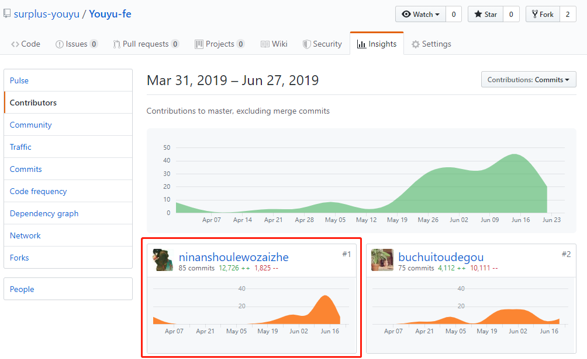
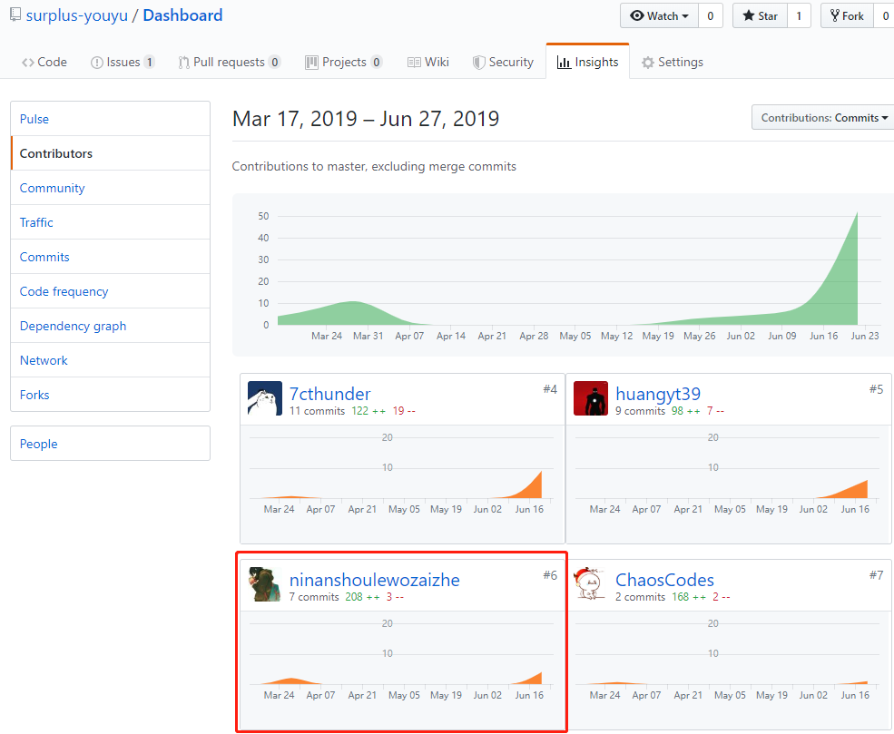

# 个人总结

## 个人简短小结

在本次项目中主要负责的是前端的工作。

UI方面：由于我们缺少设计师，所以前端兼设计师，前期与其他负责前端的同学共同设计UI，之后不断地根据需求进行调整。

web交互实现：负责项目中部分功能的实现，同时也对部分代码进行优化、封装以实现复用。

与后台对接：不断跟负责后台的同学进行联调，完善API。

## PSP2.1 统计

| PSP 2.1                                 | **Personal Software Process Stages** | **Time (%) Senior Student** |
| --------------------------------------- | ------------------------------------ | --------------------------- |
| **Planning**                            | 计划                                 | 4                           |
| — Estimate                              | 估计任务时间                         | 4                           |
| **Development**                         | 开发                                 | 137                         |
| — Analysis                              | 分析需求                             | 16                          |
| — Design Spec                           | 生成设计文档                         | 16                          |
| — Design Review                         | 设计复审                             | 1                           |
| — Coding Standard                       | 代码规范                             | 1                           |
| — Design                                | 具体设计                             | 6                           |
| — Coding                                | 具体编码                             | 90                          |
| — Code Review                           | 代码复审                             | 2                           |
| — Test                                  | 测试（自我测试，修改代码，提交修改） | 5                           |
| **Reporting**                           | 报告                                 | 3                           |
| — Test Report                           | 测试报告                             | 0                           |
| — Size Measurement                      | 计算工作量                           | 2                           |
| — Postmortem & Process Improvement Plan | 事后总结, 并提出过程改进 计划        | 1                           |

## 主要工作清单

### 记录最得意/最有价值/最有苦劳的工作清单

最有苦劳：在实现下载附件的功能时，遇到了a标签链接download失败的问题，一直显示没有找到文件，搜了很久还是没有找到解决问题的方法，最后自己用axios将文件请求过来后再给用户才解决了下载的问题。

## 在项目相关仓库中的贡献

有余前端：

Dashboard：

## 个人博客清单

[git-svn迁移](<https://blog.csdn.net/weixin_36332464/article/details/93857009>)

[前端跨域问题解决方式](<https://blog.csdn.net/weixin_36332464/article/details/93855959>)

[关于a标签下载文件的问题](<https://blog.csdn.net/weixin_36332464/article/details/93665734>)

## 特别致谢

* 后台黄术权，能够不厌其烦地调整API使前端的数据处理更加的方便。
* 后台兼前端刘俊峰，前端黄俊凯，负责认真的分工合作才能使前端项目顺利完成。
* 以及其他所有成员，缺少谁都无法完成本次项目。

