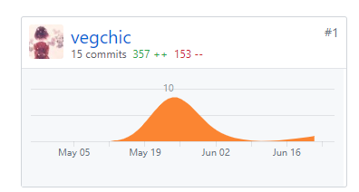

# 个人总结报告

这次项目我（@vegchic）主要负责后端 API 的编写，部署，以及一些技术文档的编写，将部署提到了 travis 上，

这是我第一次在 github 上进行团队项目开发，了解到了项目开发过程中的各种细节流程，也学习了如何去编写 API 文档以及其他技术文档。通过 travis 自动部署可以简化部署的工作，也可以控制代码风格，不过这次通过 SSH  免密部署似乎有点不太优雅，以后需要学习怎么在 travis 上远程部署 docker 容器。

做的不好的地方主要是第一次接触 Go，并直接用在开发中，所以有些实现可能比较丑陋，混杂了其他语言的风格。

代码贡献里服务端的行数极高是因为将依赖包传了上去（方便网络不好的队友）。

## 主要工作清单

- 为服务端增加 CI/CD，编排 docker-compose.yml
- 补充技术文档
- 编写 API，修复 bug

## PSP-2.1统计表

| PSP阶段                    | 耗时(h) |
| -------------------------- | ------- |
| 计划                       | 2       |
| · 估计任务时间             | 2       |
| 开发                       | 127     |
| · 分析需求                 | 16      |
| · 生成设计文档             | 16      |
| · 设计复审                 | 0       |
| · 代码规范                 | 1       |
| · 具体设计                 | 4       |
| · 具体编码                 | 90      |
| · 代码复审                 | 0       |
| · 测试                     | 0       |
| 报告                       | 2       |
| ·测试报告                  | 0       |
| ·计算工作量                | 2       |
| 事后总结，提出过程改进计划 | 2       |
| **合计**                   | 133     |

## Git 贡献

Dashboard：

服务端

数据库

## 个人博客清单

- [Go 垃圾回收机制](https://vegchic.github.io/2019/06/20/Golang%20%E5%9E%83%E5%9C%BE%E5%9B%9E%E6%94%B6%E6%9C%BA%E5%88%B6/)

## 特别致谢

感谢所有我的队友，以及其他项目的同学为我提供帮助