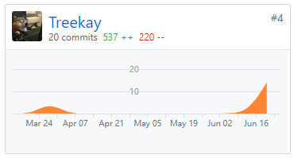

# 个人总结报告

这次项目我（@Treekay）主要负责前期的产品需求分析和设计，项目用例分析，对产品功能进行测试提出改进方法以及补充技术文档、项目文档和整理会议记录文档。总的来说这次担任产品经理的工作，没有参与项目编码开发工作，跟以往的个人项目有很大区别，比较直观的感受是前期需求分析和设计要明确、文档要写清楚，后期的开发工作是依据需求文档展开的，项目结构划分和成员分工合作很重要，即便是几个人的小组，没有统一接口，需求不明确，对接工作就会很麻烦。

## 主要工作清单

- 产品需求分析
- 项目功能测试
- 补充技术文档
- 项目文档、会议文档整理

## PSP-2.1统计表

| PSP阶段                    | 耗时(h) |
| -------------------------- | ------- |
| 计划                       | 2       |
| · 估计任务时间             | 2       |
| 开发                       | 35      |
| · 分析需求                 | 10      |
| · 生成设计文档             | 5       |
| · 设计复审                 | 5       |
| · 代码规范                 | 2       |
| · 具体设计                 | 4       |
| · 具体编码                 | 0       |
| · 代码复审                 | 4       |
| · 测试                     | 0       |
| 报告                       | 5       |
| ·测试报告                  | 0       |
| ·计算工作量                | 5       |
| 事后总结，提出过程改进计划 | 2       |
| **合计**                   | 43      |

## Git 贡献

## 个人博客清单

- [vendor包管理](https://blog.csdn.net/huangshk/article/details/93886248)

## 特别致谢

感谢小组里的所有成员，感谢各位大佬为完成项目作出的巨大贡献。