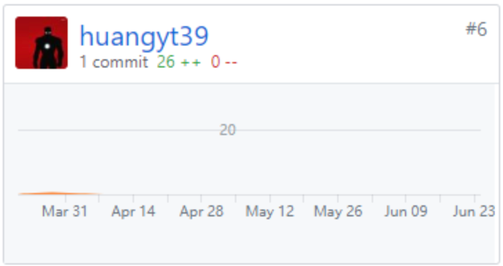

# 个人总结报告

这次项目我（@huangyt39）主要负责前期的产品需求分析和设计，后端手脚架搭建，对产品功能进行测试提出改进方法。总的来说这次担任产品经理的工作，项目编码开发工作做的比较少。在这次项目中收获到了许多，包括前期分工的确定、技术栈的确定，开发过程中的沟通、进度的调整，后期的部署和测试等。

## 主要工作清单

- 产品需求分析
- 后端手脚架搭建
- 补充技术文档

## PSP-2.1统计表

| PSP阶段                    | 耗时(h) |
| -------------------------- | ------- |
| 计划                       | 2       |
| · 估计任务时间             | 2       |
| 开发                       | 35      |
| · 分析需求                 | 3       |
| · 生成设计文档             | 3       |
| · 设计复审                 | 4       |
| · 代码规范                 | 3       |
| · 具体设计                 | 4       |
| · 具体编码                 | 10      |
| · 代码复审                 | 5       |
| · 测试                     | 0       |
| 报告                       | 2       |
| ·测试报告                  | 0       |
| ·计算工作量                | 2       |
| 事后总结，提出过程改进计划 | 2       |
| **合计**                   | 31      |

## Git 贡献

#### dashboard

#### backend

## 个人博客清单

- [Golang微框架Gin](https://blog.csdn.net/qq_36312784/article/details/94329921)

## 特别致谢

感谢各位大佬的贡献