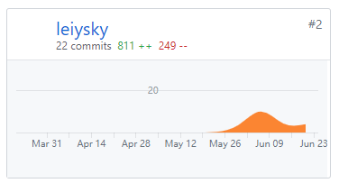

# 个人总结报告

我的 github 账号是 leiysky。

在这个项目中我主要负责后端任务相关模块的开发，以及数据库表结构的设计。

由于之前以及使用 golang 开发过多个项目，因此这次的项目中我为组内的同学们提供了一些 golang 开发的实践方式。

## 主要工作清单

- 编写 API，事务处理
- 设计数据库
- 修 bug

## PSP-2.1统计表

| PSP阶段                    | 耗时(h) |
| -------------------------- | ------- |
| 计划                       | 2       |
| · 估计任务时间             | 2       |
| 开发                       | 85      |
| · 分析需求                 | 20      |
| · 生成设计文档             | 4       |
| · 设计复审                 | 4       |
| · 代码规范                 | 5       |
| · 具体设计                 | 10      |
| · 具体编码                 | 30      |
| · 代码复审                 | 10      |
| · 测试                     | 2       |
| 报告                       | 2       |
| ·测试报告                  | 0       |
| ·计算工作量                | 2       |
| 事后总结，提出过程改进计划 | 2       |
| **合计**                   | 91     |

## Git 贡献

服务端：

## 个人博客清单

- [Go 同步机制](https://leiysky.github.io/2019/02/03/Go%E4%B8%AD%E7%9A%84%E5%90%8C%E6%AD%A5%E6%9C%BA%E5%88%B6sync/)

## 特别致谢

感谢大佬们抬一手。