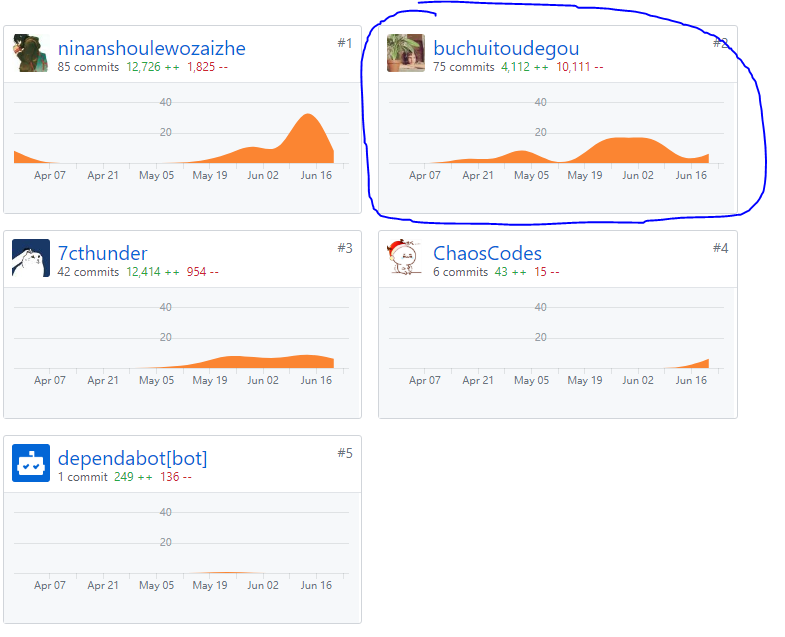
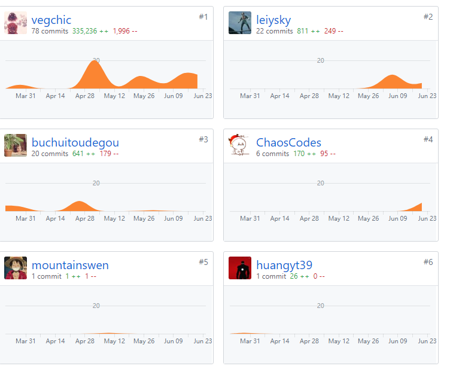
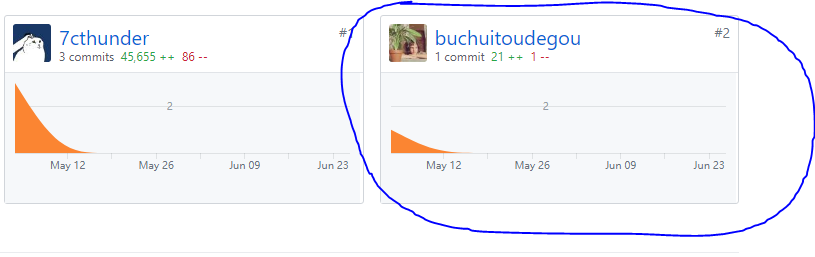
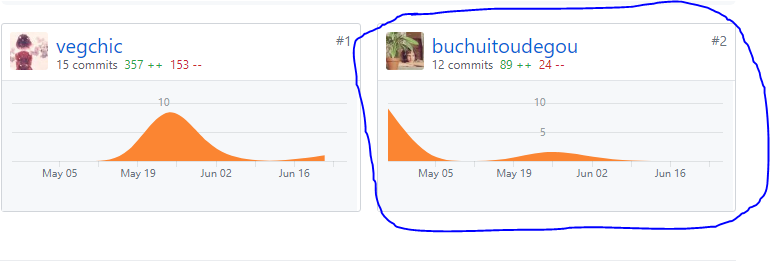
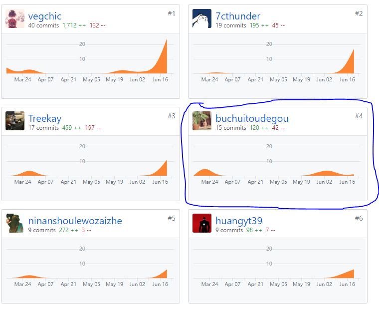

# 个人总结报告

这次项目我（@buchuitoudegou）负责后台的用户相关API设计，辅助开发前端，项目运维和部署。

尽管之前有过用gitlab团队开发的经验，但在GitHub上进行团队开发和项目管理还是第一次。在这次的开发过程中，主要熟悉了GitHub许多功能的使用，相关CI/CD的配置、webhook的配置等。尝试了gitlab-runner以外的集成技术（虽然部署起来比较麻烦）；第一次使用GO语言进行后台开发，了解到了很多后台开发需要知道的东西（数据库相关）；参与前端辅助开发，在前端开发组忙于实习工作的时候给予帮助。

## PSP-2.1统计表

| PSP阶段                    | 耗时(h) |
| -------------------------- | ------- |
| 计划                       | 2       |
| · 估计任务时间             | 2       |
| 开发                       | 95      |
| · 分析需求                 | 8       |
| · 生成设计文档             | 4       |
| · 设计复审                 | 2       |
| · 代码规范                 | 2       |
| · 具体设计                 | 4       |
| · 具体编码                 | 60      |
| · 代码复审                 | 15      |
| · 测试                     | 0       |
| 报告                       | 2       |
| ·测试报告                  | 0       |
| ·计算工作量                | 2       |
| 事后总结，提出过程改进计划 | 2       |
| **合计**                   | 101     |

## 主要工作清单
* **最有价值**：成功部署Jenkins的CI/CD；用nginx对前后端项目进行反代（部署到了不同的服务器上，需要nginx进行请求转发）

## 在项目相关仓库中的贡献
### Youyu-fe（前端）：

### Youyu-se（后端）：

### Youyu-proto（UI）:

### Youyu-db

### Dashboard

## 个人博客清单
[Docker 使用](https://github.com/buchuitoudegou/Note/blob/master/se/how%20to%20use%20docker.md)

## 特别致谢
感谢每一位团队同学的辛勤付出，没有大家的努力，我们无法完成这个项目；感谢带佬们在我遇到困难的时候积极为我解决疑惑。
